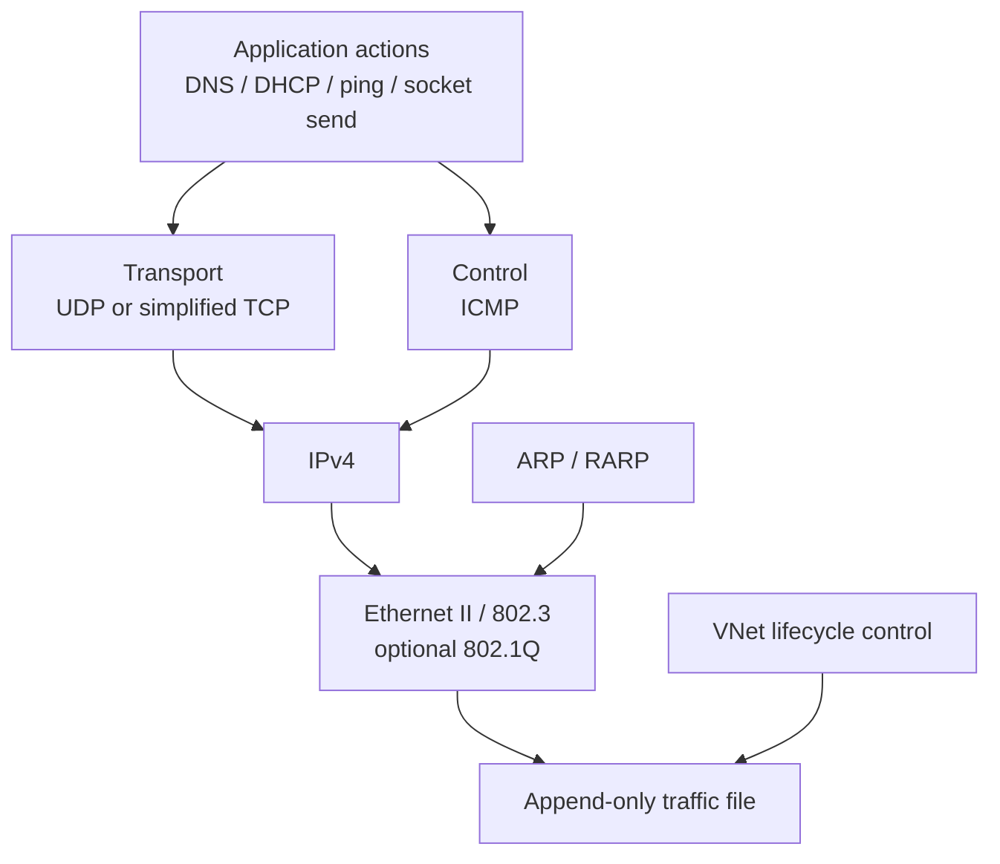
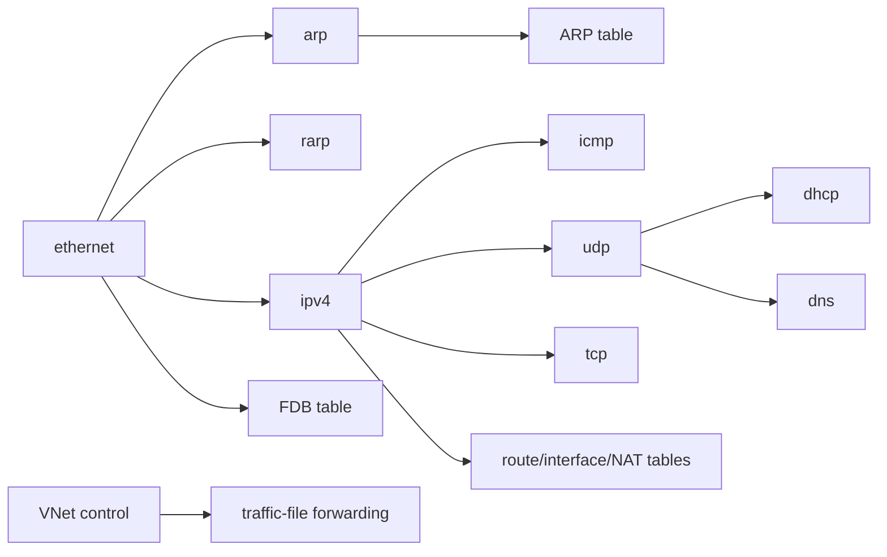
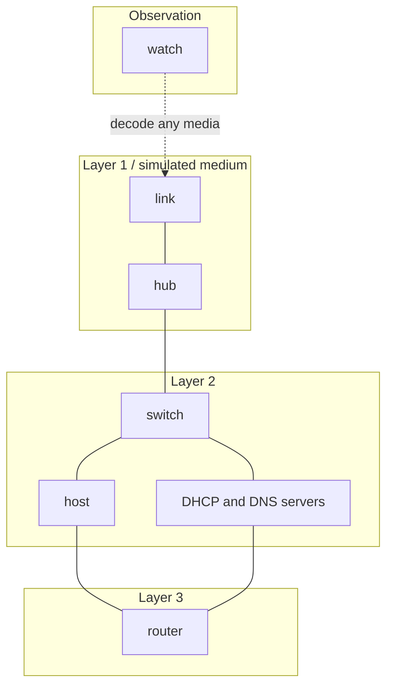

# Protocol hierarchy

VNet is organized as an inspectable IPv4 protocol stack rather than a general-purpose network stack. Targets compose the same serializers, parsers, tables, and small socket API in different ways.

## Encapsulation overview

ARP/RARP are Ethernet payloads, and VNet is local simulator metadata placed directly in the media file rather than a real network-layer protocol.

## Dependency graph

The socket layer selects TCP or UDP internally through the public `socket.h` interface.

## Protocols linked to targets

| Protocol | Primary purpose in VNet | Targets using it |
|---|---|---|
| [VNet](protocols/vnet.md) | connection lifecycle records for file topology | `link`, `hub`, `switch`, `watch` |
| [Ethernet](protocols/ethernet.md) | Layer-2 framing, MAC delivery, VLAN tags, FCS | all endpoints, `switch`, `router`, `watch` |
| [ARP](protocols/arp.md) | IPv4-to-MAC resolution | `host`, `router`, `dns_server`, `watch` |
| [RARP](protocols/rarp.md) | configured MAC-to-IPv4 answer | `host`, `router`, `watch` |
| [IPv4](protocols/ipv4.md) | packet delivery and router forwarding | `host`, `router`, DHCP/DNS servers, `watch` |
| [ICMP](protocols/icmp.md) | echo and IPv4 error feedback | `host`, `router`, `watch` |
| [UDP](protocols/udp.md) | datagrams for DHCP, DNS, and host traffic | `host`, `router`, DHCP/DNS servers, `watch` |
| [TCP](protocols/tcp.md) | basic connection/data exchange | `host`, `router` |
| [DHCP](protocols/dhcp.md) | dynamic IPv4 configuration | `host`, `dhcp_server`, `router` relay |
| [DNS](protocols/dns.md) | authoritative A/CNAME name lookup | `host`, `dns_server` |

## Targets by layer

A real network device often performs several layers at once: a router must receive Ethernet, resolve a next-hop MAC, make an IPv4 forwarding decision, and construct a new Ethernet frame. This diagram assigns each *target's teaching focus*, not an exclusive implementation layer.

## Implemented scope and intentional limits

| Area | Modeled | Deliberately simplified or omitted |
|---|---|---|
| Ethernet | preamble/SFD, II/802.3 distinction, padding, FCS, 802.1Q | physical signaling and NIC driver behavior |
| Switching | FDB learning, access/trunk VLAN policies, compact STP subset | full RSTP/MSTP, native/hybrid VLANs |
| IPv4 | addressing, checksums, TTL, local delivery | options and reassembly behavior |
| Routing | connected/static routes, ACL/NAT | dynamic control-plane protocols and convergence |
| Transport | UDP checksums; TCP base header, stateful virtual sockets | congestion control, retransmission, full TCP option/sequence semantics |
| Services | DHCPv4 offers/acks, authoritative A/CNAME DNS | DHCP lease timers and full option set; recursive DNS |

The limitation column is essential when using VNet to learn: a simplified model makes a mechanism visible, but should not be mistaken for all requirements of a production protocol implementation.
