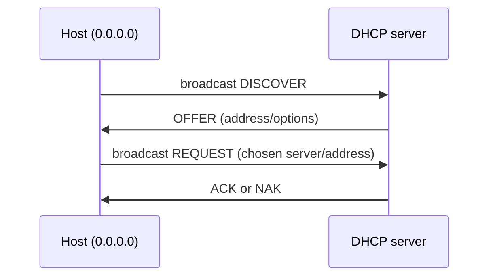

# DHCPv4

DHCP dynamically supplies IPv4 configuration. VNet models the broadcast client/server exchange so a host can learn an address, subnet mask, default gateway, and DNS server rather than receiving them as fixed startup arguments.

| Element | VNet model |
|---|---|
| Transport | UDP 68 → 67 in IPv4/Ethernet |
| Identity | transaction ID and client MAC match the exchange |
| Server state | bounded lease table, address pool, optional MAC reservation |
| Options | mask, gateway, and DNS supplied in server messages |
| Relay | router can associate an ingress interface with a DHCP server |

`src/protocol/dhcp.{h,c}` defines message writers/parsers; the service is `dhcp_server`. Start it with `dhcp_server <file> <mac> <server-ip>`, configure via `config`, and inspect or reserve with `lease`. At the host use `dhcp`.

A real DHCP server has lease timers, renewal/rebinding, many options, relay agent behavior, persistence, and security controls. VNet models the discovery-selection-acknowledgement path and keeps service state owned by the DHCP appliance.