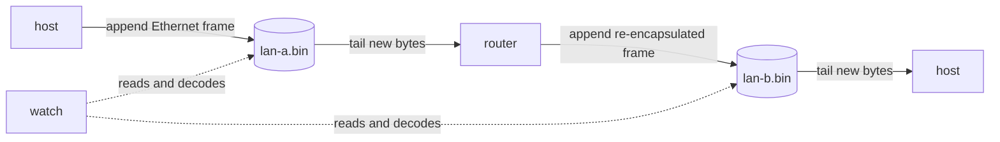
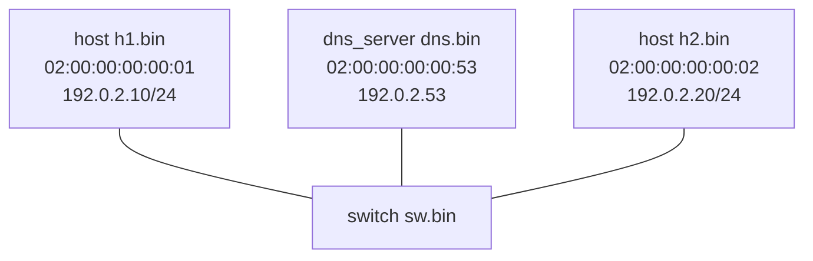
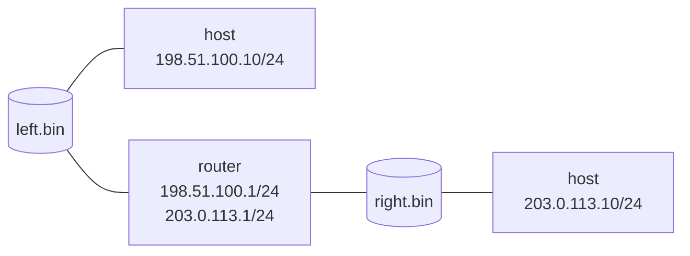

# Simulating networks with VNet

VNet is a C17 study simulator for *IP-based networks*. It uses ordinary append-only files as observable network media: a target writes bytes by appending to its file and receives later bytes by tailing that file. This keeps every exchange inspectable with `watch`, rather than hiding it inside an operating-system network stack.

> **Educational model, not an Internet replacement.** VNet deliberately represents selected protocol fields and state machines so that students can follow an exchange end to end. It is not interoperable with a physical NIC, does not implement every RFC behavior, and uses one host/compiler configuration for its local `vnet` control records.

## Build and the medium model

From the repository root, build the runnable targets with:

```bash
bbs build
```

Create the files used as media before starting a topology. In Git Bash, for example:

```bash
: > lan-a.bin
: > lan-b.bin
```

Targets open their input file at its current end. Start the topology before generating traffic, otherwise earlier bytes are intentionally treated as historical traffic rather than a new packet.



Each target has an interactive command loop. Type `help` in a running target to list its registered commands, `info` to inspect its state, and use end-of-file (normally `Ctrl+D`) to end the loop.

## Targets and when to use them

| Target | Modeled role | Why use it in a lab | Main configuration surface |
|---|---|---|---|
| `host` | Ethernet/IP endpoint | Generate ARP, DHCP, DNS, ICMP, UDP, TCP, IPv6/NDP traffic | startup IPv4/DNS/DHCP settings; `config`, `ping`, `udp`, `socket` |
| `link` | Point-to-point link | Join two media and introduce repeatable impairment | latency, jitter, bandwidth, queue, loss, corruption, FCS failure, reordering |
| `hub` | Shared Layer-1 medium | See collision-domain-style repetition: every ingress reaches every other port | startup port files; read-only `info` |
| `switch` | Learning Layer-2 bridge | Study FDB learning, VLAN admission/tagging, and loop prevention | access/trunk ports, bridge identity, `fdb`, `stp` |
| `router` | Multi-interface IP router | Study forwarding, ARP, routes, RIP/OSPF/BGP, ACLs, NAT/PAT, VLAN subinterfaces | interfaces, routes, policies, routing modes, NAT, DHCP relay |
| `dhcp_server` | DHCPv4 service | Observe address and option assignment without hard-coded host configuration | address pool, mask, gateway, DNS, reservations |
| `dns_server` | Authoritative DNS service | Study DNS queries over UDP/IP/Ethernet and A/CNAME answers | authoritative records and name blacklist |
| `watch` | Passive dissector | Inspect raw bytes and nested VNet/Ethernet/IP/transport records | a media file; read-only `info` |

Detailed target references are in [`targets/`](targets/).

## A first LAN

This topology puts two hosts and a DNS server on one switched VLAN. Use distinct files for endpoint attachment and a distinct switch-medium file.



```bash
: > h1.bin; : > h2.bin; : > dns.bin; : > sw.bin
bbs run -t switch -a sw.bin -f access 10 h1.bin access 10 h2.bin access 10 dns.bin
bbs run -t dns_server -a dns.bin 02:00:00:00:00:53 192.0.2.53 A example.test 192.0.2.20
bbs run -t host -a h1.bin 02:00:00:00:00:01 -ip4 192.0.2.10 -mask 255.255.255.0 -dns 192.0.2.53
bbs run -t host -a h2.bin 02:00:00:00:00:02 -ip4 192.0.2.20 -mask 255.255.255.0
bbs run -t watch -a h1.bin
```

In the `h1` command loop, try:

```text
ping 192.0.2.20
dns example.test
udp 40000 9999 192.0.2.20 hello
info
```

The first IPv4 exchange normally creates ARP traffic before the ICMP, UDP, or DNS packet. `watch` makes the encapsulation and checks visible.

## Two routed LANs

Give the router one interface on each LAN. A host uses its local router interface as its default gateway; the router derives connected routes from its interfaces.



```bash
: > left.bin; : > right.bin
bbs run -t router -a -i left.bin 02:00:00:00:01:01 198.51.100.1 255.255.255.0 -i right.bin 02:00:00:00:02:01 203.0.113.1 255.255.255.0
bbs run -t host -a left.bin 02:00:00:00:01:10 -ip4 198.51.100.10 -mask 255.255.255.0 -gateway 198.51.100.1
bbs run -t host -a right.bin 02:00:00:00:02:10 -ip4 203.0.113.10 -mask 255.255.255.0 -gateway 203.0.113.1
```

Then run `ping 203.0.113.10` on the left host. Compare the two LAN captures: the IP destination remains the end host, but the Ethernet source/destination change at the router's egress.

## Services and dynamic configuration

### DHCPv4

Start a server on the same Layer-2 segment as a host. Configure its pool interactively, then use `dhcp` at the host. The service models broadcast discovery and request, then supplies an address, mask, gateway, and DNS option.

```bash
bbs run -t dhcp_server -a lan.bin 02:00:00:00:00:fe 192.0.2.254
```

At the server:

```text
config 192.0.2.100 192.0.2.150 255.255.255.0 192.0.2.1 192.0.2.53
lease reserve 02:00:00:00:00:01 192.0.2.110
```

At a host started with `-dhcp` (or configured with a DHCP server), run `dhcp` and then `info`.

### DNS

The DNS appliance is authoritative only: it responds to A and CNAME records it owns, and can deliberately return a simulated name error for a blacklisted or unknown name. It does not recurse to the public DNS hierarchy.

```text
record add A www.example.test 192.0.2.20
record add CNAME portal.example.test www.example.test
blacklist add blocked.example.test
```

## Link and topology experiments

`link` is useful when two separate files should act like a cable. `-b` enables reverse forwarding. Its impairment flags make loss or delay deterministic when used with `-seed`.

```bash
bbs run -t link -a left.bin right.bin -b -latency 25 -jitter 5 -loss 100 -seed 7
```

Rates expressed as `permyriad` are out of 10,000: `100` means 1%. Use `link down` and `link up` at runtime to compare administrative failure with random loss.

For a shared medium, use `hub` rather than several pairwise connects:

```bash
bbs run -t hub -a hub.bin -f h1.bin h2.bin server.bin
```

A hub repeats opaque bytes to every other port; a switch instead reads Ethernet headers, learns individual source MAC addresses, and forwards known unicast selectively.

## What to observe in every experiment

| Question | Useful target/state | Expected evidence |
|---|---|---|
| Who owns a local IPv4 address? | `host info`, `dhcp_server info` | configured address or lease mapping |
| How is a next-hop MAC discovered? | `host arp`, `router arp`, `watch` | ARP request/reply followed by the queued IP packet |
| Why did a frame flood? | `switch fdb`, `watch` | unknown/broadcast/multicast destination and FDB state |
| Why did a packet not route? | `router info`, `route`, ACL counters | no matching route, interface state, or policy denial |
| Did a VLAN cross a trunk? | `switch info`, `watch` | 802.1Q tag retained on trunk, removed on access egress |
| Did a protocol field survive the path? | captures on both media | unchanged L3/L4 semantics but per-hop Ethernet headers |

See [`protocol_hierarchy.md`](protocol_hierarchy.md) for the full protocol map and [`protocols/`](protocols/) for protocol-level explanations.
