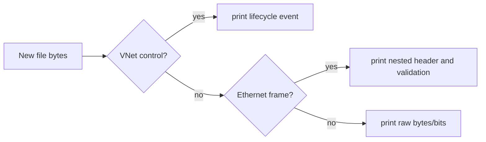

# `watch` target

`watch` is the passive network-file dissector. It tails a medium from its current end and prints VNet lifecycle frames, validated Ethernet frames, nested recognized protocols, or raw bytes when the data cannot be decoded.

## Startup and command

```text
watch <file>
```

Use `info` to display the watched path. Start it before generating traffic, because it begins at the file's existing EOF.

## Decode path



It recognizes Ethernet framing and uses ARP/RARP/IPv4/ICMP/TCP/UDP parsers for nested output. VNet records are held across read chunks when incomplete, avoiding a partial control frame being misread as ordinary data.

This is closer to a teaching dissector than tcpdump/Wireshark: it decodes the simulator's defined formats and exposes physical-order bits for raw octets. Use it beside every topology exercise to verify whether a failure occurred before Layer 2, during address resolution, at routing, or in the application payload.